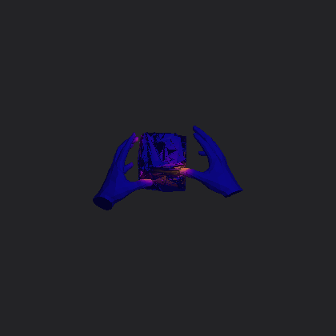
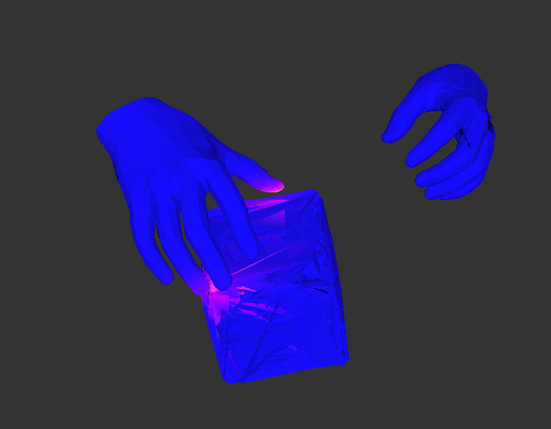
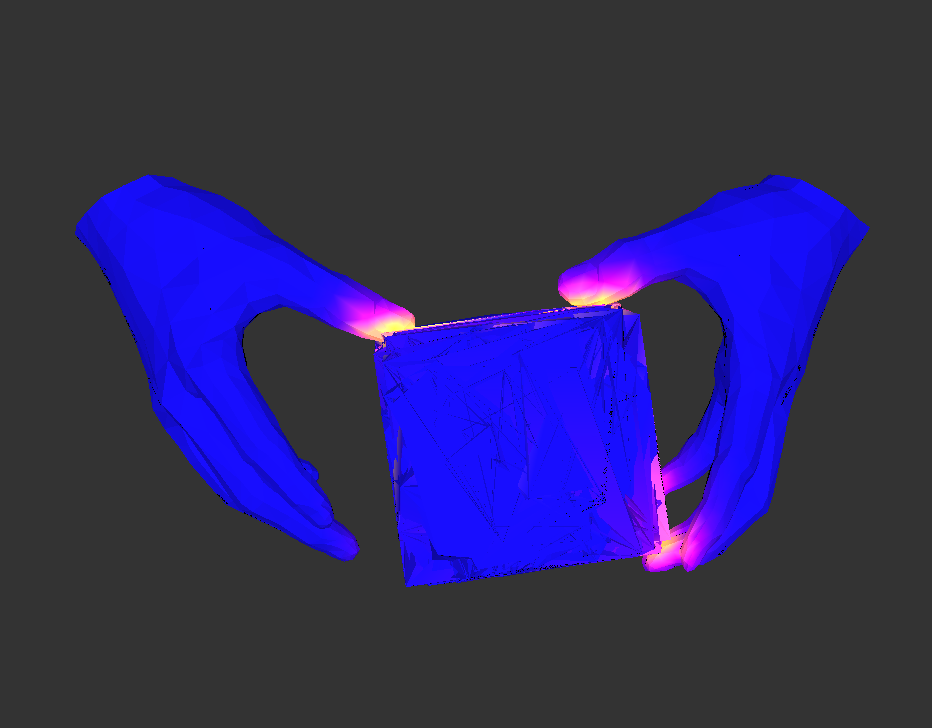
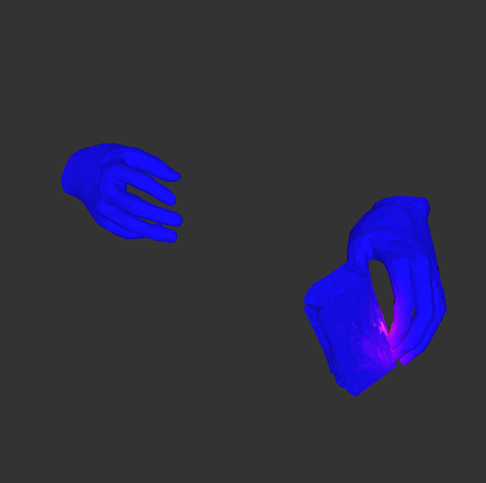
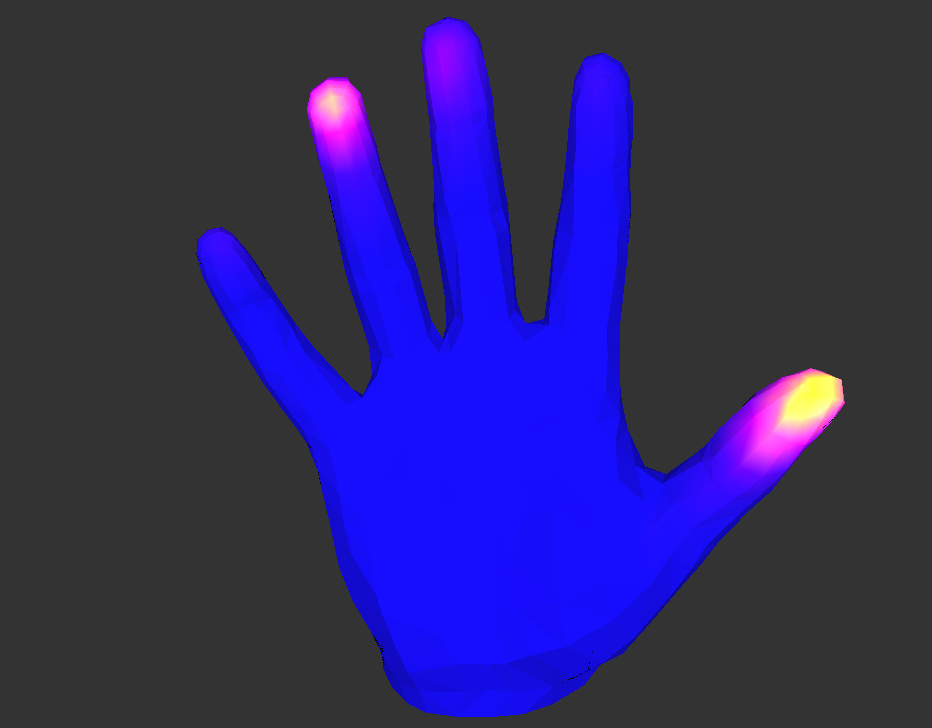
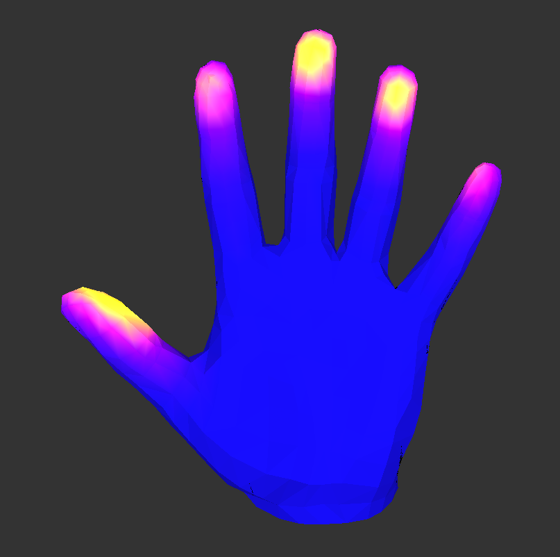
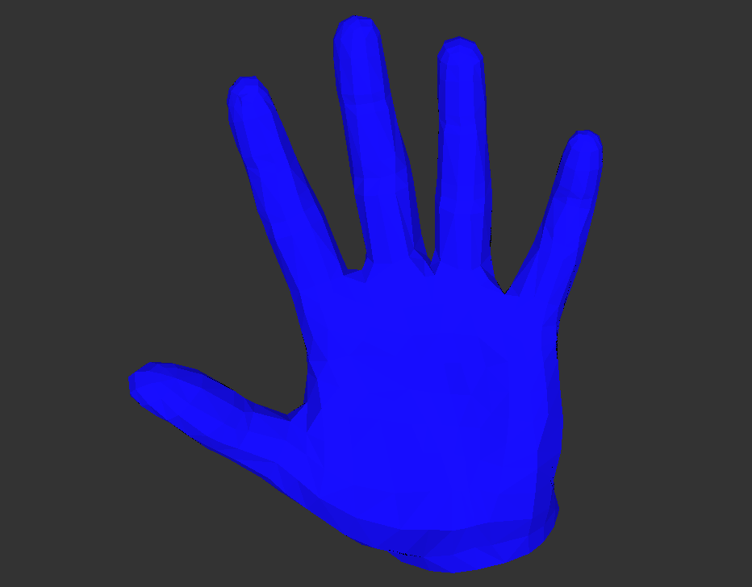
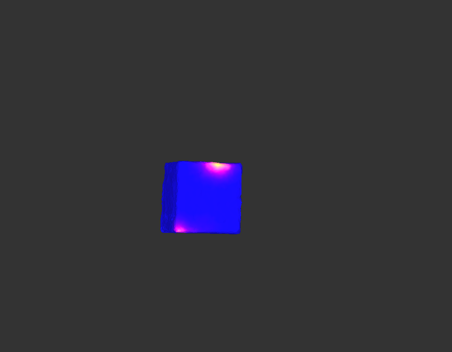
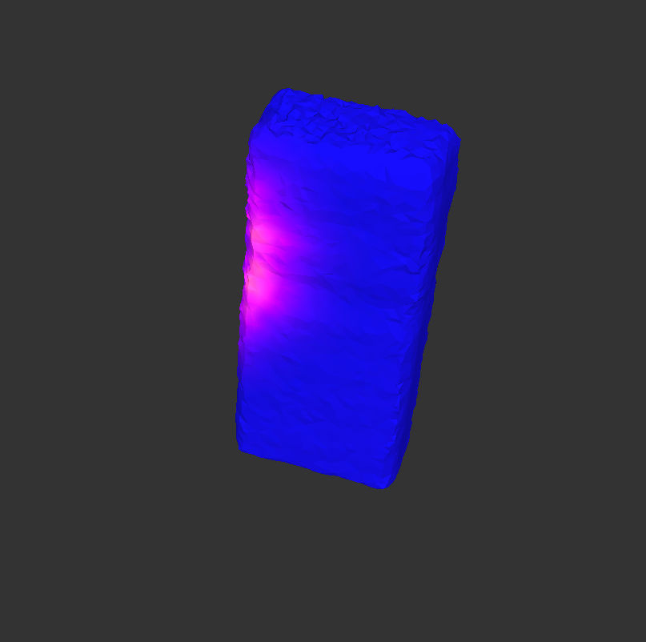

# ArcticMeshVis

**High-fidelity 3D hand-object mesh reconstruction with contact-map visualization on the ARCTIC dataset.**

<p align="center">
  
</p>

<p align="center">
  <em>Live 360° rotation of a reconstructed bimanual grasp — both MANO hands and the manipulated object in one combined mesh, with per-vertex contact heatmap baked in (rendered from <code>archicmeshvis/000020_combined_pose.obj</code>).</em>
</p>

---

## Overview

ArcticMeshVis is a research project (Feb–Jul 2023) for **hand-object mesh reconstruction and analysis** on the [ARCTIC](https://arctic.is.tue.mpg.de/) dataset. The pipeline combines:

- **FastInst** instance segmentation for hand/object masks.
- **MANO** parametric hand model + **GraFormer / PoseFormer** for 3D keypoint regression.
- **Analytical Inverse Kinematics (AIK)** to recover joint rotations from 3D keypoints.
- An object pose / mesh estimation branch.
- A **contact-map** module ([`contact_map.py`](contact_map.py)) that computes per-vertex hand↔object proximity via nearest-neighbour queries and renders it as a `magma`-style heatmap (blue → magenta → yellow = increasing contact).

---

## Results Gallery

All images below are **real outputs from the pipeline**, not stock photos.

### 1. Full bimanual scene reconstruction

<p align="center">
  
</p>

A complete scene from ARCTIC: the **left hand** grasping a box-shaped object while the **right hand** is open in mid-reach. Both hands are MANO meshes; the object mesh is reconstructed from the same frame. Contact heatmap (magenta/pink) lights up exactly where fingertips press into the object surface — note the bright contact on the index fingertip and along the lower edge of the box.

### 2. Bimanual grasp with contact heatmap

<p align="center">
  
</p>

Both hands grasping the object symmetrically. The contact map highlights fingertip-to-surface contact on all four engaged fingertips, plus a secondary contact patch along the lower-right corner of the box — exactly the regions a physics-aware grasp model would predict.

### 3. Single-hand grasp

<p align="center">
  
</p>

A right-hand single-handed grasp on a tall rectangular object. The contact intensity at the index/thumb pinch is clearly visible, while the left hand sits idle — useful for evaluating asymmetric manipulation phases.

### 4. Hand-side contact maps

<table>
<tr>
<td width="33%"></td>
<td width="33%"></td>
<td width="33%"></td>
</tr>
<tr>
<td align="center"><em>Pinch contact: thumb + middle fingertip light up brightest.</em></td>
<td align="center"><em>Full power-grasp: all five fingertips in contact.</em></td>
<td align="center"><em>Baseline MANO mesh, no contact (open hand).</em></td>
</tr>
</table>

These views isolate the **hand-side contact map** — the same scalar field used during training as a soft supervision signal. The colormap goes from deep blue (no contact / far) through magenta to bright yellow (high contact / near zero distance).

### 5. Object-side contact maps

<table>
<tr>
<td width="50%"></td>
<td width="50%"></td>
</tr>
<tr>
<td align="center"><em>Box object: contacts localized at top-right corner and bottom edge.</em></td>
<td align="center"><em>Bar-shaped object: vertical contact band where the hand wraps around.</em></td>
</tr>
</table>

The **object-side contact map** is the symmetric counterpart — each object vertex coloured by its distance to the nearest hand vertex. Pairing this with the hand-side map enables consistency losses across the two meshes.

---

## How the rotating GIF was generated

The hero animation at the top is rendered from the raw output mesh [`archicmeshvis/000020_combined_pose.obj`](archicmeshvis/000020_combined_pose.obj) (1,981 vertices, 8,071 faces, per-vertex RGB colours encoding the contact heatmap). The renderer is a small **software rasterizer** (no GPU / display required), packaged at [`scripts/make_rotating_gif.py`](scripts/make_rotating_gif.py).

**How it works:**
1. Load the `.obj` with `trimesh`, preserving per-vertex colours.
2. Centre the mesh and flip the Y/Z axes (ARCTIC exports are Y-down).
3. For 36 evenly-spaced angles around the Y axis:
   - Rotate the vertex positions.
   - Project orthographically to screen space.
   - Rasterize each triangle with a numpy z-buffer, interpolating vertex colours barycentrically and applying simple Lambert shading.
4. Pack the 36 frames into a looping GIF with Pillow.

**Reproduce it:**

```bash
pip install trimesh pillow numpy
python3 scripts/make_rotating_gif.py \
    --obj archicmeshvis/000020_combined_pose.obj \
    --out assets/rotating_mesh.gif \
    --size 420 --frames 36 --fps 18
```

GitHub renders animated GIFs inline in `README.md` automatically — no embedding tricks needed. Just commit the GIF into the repo and reference it with a regular `` tag (as done at the top of this file).

---

## Repository Layout

```
ArcticMeshVis/
├── AIK/                       # Analytical inverse kinematics (torch)
├── archicmeshvis/             # Sample model outputs (PNG + .obj)
├── assets/                    # Rendered figures used in this README
├── configs/                   # FastInst configs (COCO / instance-seg)
├── demo/
│   ├── demo.py                # Inference entry point
│   └── predictor.py
├── fastinst/                  # FastInst + GraFormer + PoseFormer
├── mano/                      # MANO hand model wrapper
├── scripts/
│   └── make_rotating_gif.py   # Rotating-GIF renderer (this README's hero)
├── contact_map.py             # Hand↔object contact map computation
├── engine.py                  # Training / evaluation engine
├── INSTALL.md
├── LICENSE
└── ugcv_environment.yml
```

---

## Getting Started

```bash
git clone https://github.com/yihalem1/ArcticMeshVis.git
cd ArcticMeshVis
conda env create -f ugcv_environment.yml
conda activate fastinst
```

Detailed environment + Detectron2 setup: see [INSTALL.md](INSTALL.md).

**Run the instance-segmentation demo:**

```bash
python demo/demo.py \
    --config-file configs/coco/instance-segmentation/fastinst_R50_ppm-fpn_x1_576.yaml \
    --input path/to/images/*.jpg \
    --output outputs/ \
    --confidence-threshold 0.5
```

**Compute hand-object contact maps** from predicted MANO + object meshes:

```bash
python contact_map.py
```

---

## Applications

- **Robotics** — learn grasp policies from realistic contact supervision.
- **VR / AR** — accurate two-hand tracking with physically-plausible object interaction.
- **Ergonomics** — quantitative measurement of how products are gripped and manipulated.
- **HCI research** — fine-grained bimanual interaction analysis.

---

## Acknowledgements

This project builds on:
- [FastInst](https://github.com/junjiehe96/FastInst)
- [Detectron2](https://github.com/facebookresearch/detectron2)
- [MANO](https://mano.is.tue.mpg.de/)
- The [ARCTIC](https://arctic.is.tue.mpg.de/) and [H2O](https://taeinkwon.com/projects/h2o/) datasets.

## License

See [LICENSE](LICENSE).
